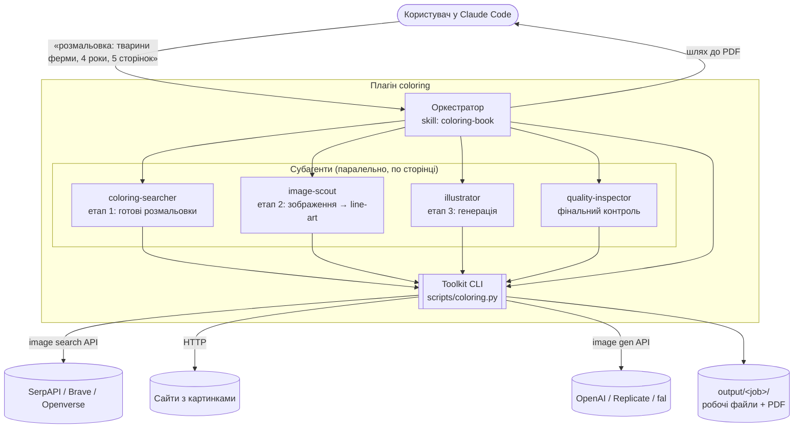
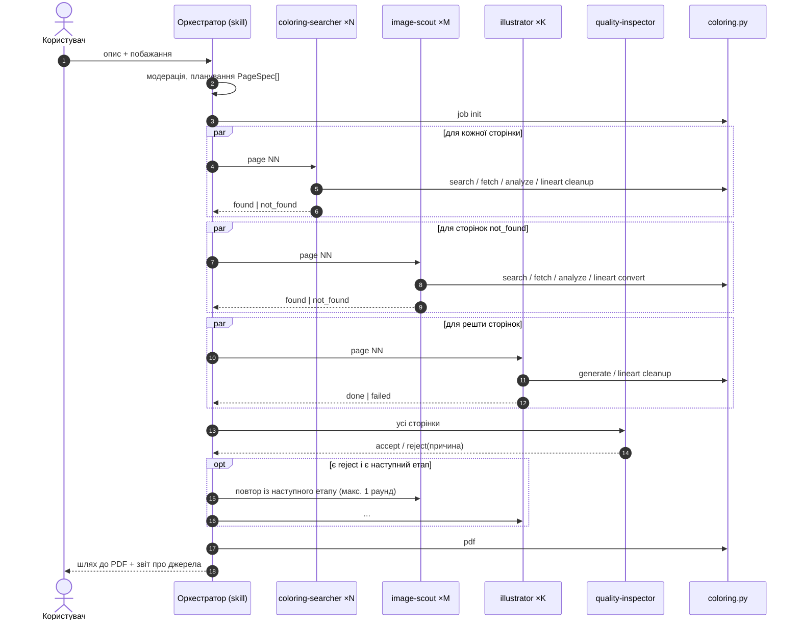
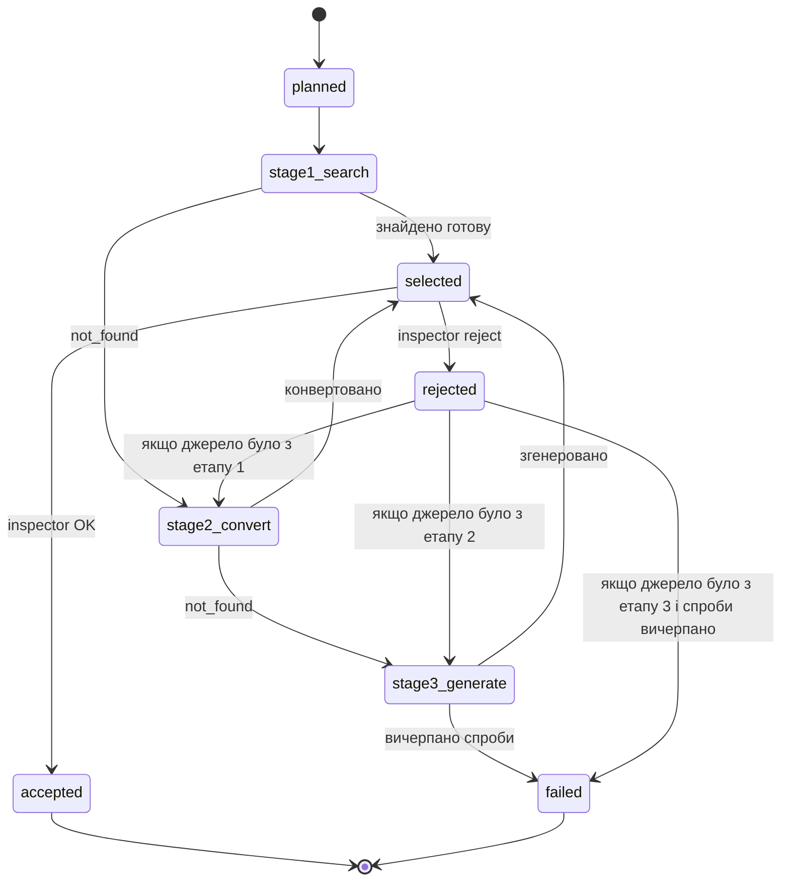

# Архітектура: генератор розмальовок (Claude Code plugin)

> Статус: **проєкт v0.1** · Аудиторія документа: розробники плагіна

## 1. Мета

Користувач у Claude Code описує, яку розмальовку хоче отримати. Плагін повертає PDF формату **A4**: одну сторінку або кілька.

Джерело зображення для кожної сторінки обирається каскадом:

1. **Готова розмальовка** з інтернету.
2. **Зображення, придатне для конвертації** (фото, кліпарт, ілюстрація), яке перетворюється на контурний малюнок.
3. **Генерація** розмальовки зовнішньою моделлю.

## 2. Зафіксовані вимоги

| # | Питання | Рішення |
|---|---------|---------|
| R1 | Аудиторія | **Діти та батьки**. Жорстка модерація контенту, рівні складності за віком |
| R2 | Інтерфейс | **Claude Skill / плагін для Claude Code**. Окремого бекенда немає |
| R3 | «Кілька сторінок» | **N варіантів однієї теми** і **набір за темою** (Claude сам розбиває тему на сторінки). Серії з консистентним персонажем поза скоупом |
| R4 | Ліцензії | **Особисте використання**, джерела будь-які. Джерело кожної сторінки фіксується й друкується в PDF |
| R5 | Генерація | **Зовнішнє API** за адаптером, провайдер змінюється конфігом. **Поки вимкнена** (`generate.enabled: false`): якщо сторінку можна отримати лише генерацією, завдання зупиняється без PDF (§5.3) |
| R6 | Середовище | **Claude Code** (повний доступ до мережі й файлової системи) |
| R7 | Збереження | **Тільки PDF і робочі файли в папці**. Бібліотеки для повторного використання немає |
| R8 | Результат роботи | Цей документ + каркас плагіна |

### Припущення (вподобань не висловлено, прийнято за замовчуванням)

| # | Припущення |
|---|-----------|
| A1 | Параметри витягуються з природної мови: вік/складність, кількість сторінок, підписи, орієнтація |
| A2 | Ліміт: **10 сторінок** на запит, за замовчуванням 1 |
| A3 | Складність за замовчуванням `medium` (6–8 років) |
| A4 | Орієнтація визначається автоматично за пропорціями зображення |
| A5 | Підпис під малюнком мовою запиту вмикається за бажанням. Для наборів обкладинка вмикається за замовчуванням |
| A6 | Мова запиту будь-яка. Пошукові запити й промпти генерації пишуться **англійською** |
| A7 | Пошук зображень іде через **API пошуку картинок** (адаптер, за замовчуванням SerpAPI/Google Images), з **SafeSearch = strict** |
| A8 | Генерація за замовчуванням через OpenAI `gpt-image-1`, альтернативи через адаптер (Replicate/fal Flux) |

## 3. Огляд архітектури

Плагін складається з трьох шарів:

1. **Оркестратор** (skill `coloring-book`). Працює в головній сесії Claude: планує сторінки, запускає субагентів поетапно й паралельно, збирає PDF.
2. **Субагенти** (`agents/*.md`) зі спеціалізованими ролями та ізольованим контекстом. Важкі зображення не потрапляють у контекст головної сесії.
3. **Toolkit** (Python CLI `scripts/coloring.py`). Детерміновані операції: пошук через API, завантаження, метрики зображень, конвертація в line-art, генерація, верстка PDF.



### Чому саме так

- **Головна сесія лише оркеструє.** У Claude Code субагенти не можуть запускати інших субагентів, тому весь контроль потоку живе в skill.
- **Один субагент на сторінку й етап.** Сторінки обробляються паралельно. Перегляд десятків кандидатів-зображень (vision) відбувається в ізольованому контексті субагента, а наверх повертається лише короткий JSON-результат.
- **Скрипти для детермінованої роботи, LLM для оцінки.** Метрики пікселів, бінаризація й верстка дешеві та відтворювані. LLM потрібна там, де є судження: чи відповідає картинка опису, чи вона безпечна, чи гарна як розмальовка.
- **Файли як контракт.** Агенти обмінюються даними через `page.json` у робочій папці, а не через контекст. Кожна сторінка має власний файл, тому немає гонок при паралельному записі.

## 4. Компоненти

### 4.1 Оркестратор: skill `coloring-book`

Файл: `skills/coloring-book/SKILL.md`. Відповідає за:

1. **Модерацію запиту** (R1). Неприйнятні для дітей теми відхиляються або м'яко переформульовуються.
2. **Планування.** Розбирає запит у `JobSpec` і список `PageSpec` (див. §6).
3. **Створення робочої папки** (`coloring.py job init`).
4. **Поетапний запуск** субагентів за каскадом (§5). Етап N+1 запускається лише для сторінок, які не закрив етап N.
5. **Фінальний контроль** через `quality-inspector`. Відхилені сторінки повертаються на наступний етап каскаду.
6. **Верстку PDF** (`coloring.py pdf`) і звіт користувачу: шлях до PDF, джерело кожної сторінки, що не вдалося.

Модель успадковується від сесії.

### 4.2 Субагенти

| Агент | Етап | Модель | Інструменти | Вхід | Вихід |
|-------|------|--------|-------------|------|-------|
| `coloring-searcher` | 1 | `sonnet` | Bash, Read, WebSearch, WebFetch | `page.json` | `stage1` у `page.json`: обраний файл або `not_found` |
| `image-scout` | 2 | `sonnet` | Bash, Read, WebSearch, WebFetch | `page.json` | `stage2`: сконвертований line-art або `not_found` |
| `illustrator` | 3 | `sonnet` | Bash, Read | `page.json` | `stage3`: згенерований line-art або `failed` |
| `quality-inspector` | фінал | `sonnet` | Bash, Read | усі `page.json` | вердикт по кожній сторінці: `accept` / `reject` + причина |

Ролі детальніше:

- **coloring-searcher.** Формує 2–3 англомовні запити (`"<subject> coloring page for kids"`, `"<subject> outline drawing"`). Отримує кандидатів через `coloring.py search --kind coloring`, завантажує їх і рахує метрики (`analyze`). Візуально переглядає лише топ-K після автоматичного фільтра. Обраний файл очищує (`lineart --mode cleanup`: бінаризація, обрізання полів, видалення дрібного сміття).
- **image-scout.** Шукає зображення, що **добре конвертуються**: один чіткий об'єкт, простий або однотонний фон, контраст, мультяшний чи кліпарт-стиль краще за фото. Рахує `convertibility_score`, конвертує 1–3 найкращих (`lineart --mode convert`) і візуально оцінює результат, а не оригінал.
- **illustrator.** Пише промпт за шаблоном стилю (§7.3) і генерує 1–2 варіанти (`generate`). Чистить результат (`lineart --mode cleanup`) і перевіряє його. Має до 2 спроб із виправленим промптом.
- **quality-inspector.** Незалежна перевірка, щоб агент, який знайшов картинку, не оцінював її сам. Дивиться на фінальні PNG, які підуть у PDF. Перевіряє критерії з §8, безпеку та відповідність опису, а для наборів також узгодженість стилю й складності.

### 4.3 Toolkit: `scripts/coloring.py`

Єдиний CLI з підкомандами. Кожна команда читає й пише JSON, тож агенти парсять stdout.

| Команда | Призначення |
|---------|-------------|
| `job init --request ... --spec spec.json` | Створює `output/<job-id>/`, `job.json`, `pages/NN/page.json` |
| `search --query Q --kind coloring\|image --limit N` | Пошук картинок через адаптер провайдера (SafeSearch strict). Повертає кандидатів: `url, thumb_url, source_page, title, w, h` |
| `extract-images --page-url URL` | Дістає картинки зі сторінки, яку знайшов WebSearch: `og:image`, прямі посилання на файли, `` (з `srcset`, lazy-атрибутами, Next.js-проксі), відкидає іконки й логотипи |
| `fetch --candidates LIST.json \| --url U... --out DIR` | Паралельне пакетне завантаження з перевірками (формат, розмір, мінімальна роздільність, заблоковані домени) і відсіюванням майже-дублікатів за pHash; походження зберігається в `DIR/index.json` |
| `analyze --dir DIR \| --image F... [--sort lineart\|convertibility]` | Метрики для пачки: `lineart_score`, `convertibility_score`, частки кольору/сірого/суцільних заливок, товщина ліній, замкнені області, `text_likelihood` (водяні знаки, підписи), pHash |
| `lineart --image F --mode cleanup\|convert --profile P` | Приведення до чистого чорно-білого контуру потрібної товщини (§7.2) |
| `generate --prompt P --out F [--provider X]` | Генерація через адаптер провайдера |
| `thumb --image F` | Зменшена копія для перегляду vision (економія токенів) |
| `pdf --job DIR` | Верстка A4 PDF з фінальних PNG (§9) |

Провайдери винесені за інтерфейси:

```python
class ImageSearchProvider(Protocol):
    def search(self, query: str, kind: Kind, limit: int, safe: bool = True) -> list[Candidate]: ...

class ImageGenProvider(Protocol):
    def generate(self, prompt: str, size: tuple[int, int], n: int = 1) -> list[bytes]: ...
```

Реалізації: `serpapi`, `brave`, `openverse` (без ключа, fallback) і `openai`, `replicate`, `fal`. Провайдер обирається в `config.yaml`.

Особливості пошуку (перевірено на реальних даних):

- **SerpAPI** використовує фільтр типу Google Images: `itp:lineart` для розмальовок, `itp:clipart` для етапу 2.
- **Openverse** не потребує ключа й добре знаходить кліпарт та ілюстрації, але готових розмальовок у ньому майже немає.
- Для етапу 1 найкраще працюють **сайти розмальовок** (WebSearch → `extract-images`): вони віддають чисті контурні малюнки 600–1000 px.

## 5. Потік обробки

### 5.1 Поетапний каскад з паралельністю по сторінках



### 5.2 Стани сторінки



Сторінка у стані `failed` не блокує PDF. Користувач отримує частковий результат і пояснення.

### 5.3 Генерація вимкнена: зупинка завдання

Поки `generate.enabled: false`, етапу 3 немає. Якщо після етапу 2 лишилася хоч одна сторінка без зображення, або інспектор відхилив сторінку, наступним етапом для якої була б генерація, оркестратор:

1. більше не запускає субагентів і не збирає PDF;
2. викликає `coloring.py job stop --reason generation_disabled --pages ...` (статус `stopped` у `job.json`);
3. пояснює користувачу, яким сторінкам не знайшлося придатних зображень, і пропонує змінити тему. Знайдені кандидати лишаються в робочій папці.

`coloring.py generate` при вимкненій генерації завершується помилкою, тож етап 3 не запуститься випадково.

### 5.4 Відомі персонажі та показ кандидатів

Перший реальний запуск показав проблему: сайти з фанатськими розмальовками підписують малюнок іменем персонажа, навіть коли він на персонажа не схожий. Тому:

- **Еталон.** Якщо тема — конкретний персонаж (поле `character` у `PageSpec`), агент етапу спершу знаходить його офіційне зображення (фан-вікі, сайт студії), зберігає його як `ref/ref.png` і описує впізнавані риси в `ref/notes.md`. Кожного кандидата він порівнює з еталоном і оцінює схожість (`high` / `medium` / `low`); `low` ніколи не приймається. Інспектор теж звіряється з еталоном.
- **Показ кандидатів** (`preview: true`). Вмикається, коли користувач просить «спочатку покажи» або відхилив готову сторінку. Агент нічого не обирає: пише `candidates.json` і будує таблицю (`coloring.py sheet`): еталон REF і пронумеровані кандидати. Оркестратор показує її користувачу і чекає на вибір, а `coloring.py job select --n N` очищає обраний малюнок у `final.png` (попередній зберігається як `previous_final_K.png`). Сторінку, обрану користувачем, інспектор не відхиляє через схожість чи смак, лише через жорсткі проблеми (безпека, текст, сірі заливки).

Формат і правила описані в `skills/coloring-book/reference/characters-and-preview.md`.

## 6. Планування запиту

Оркестратор перетворює запит на `JobSpec`:

```json
{
  "request": "розмальовка тварини ферми для 4-річної, 5 сторінок, з підписами",
  "language": "uk",
  "mode": "set",               // "variants" | "set"
  "difficulty": "easy",        // easy | medium | hard
  "captions": true,
  "cover": true,
  "pages": [
    { "n": 1, "subject": "cow",     "caption": "Корова",  "query_hints": ["cartoon cow", "cow farm"] },
    { "n": 2, "subject": "pig",     "caption": "Свинка",  "query_hints": ["cute pig"] },
    { "n": 3, "subject": "duck",    "caption": "Качечка", "query_hints": [] },
    { "n": 4, "subject": "horse",   "caption": "Конячка", "query_hints": [] },
    { "n": 5, "subject": "chicken", "caption": "Курочка", "query_hints": [] }
  ]
}
```

Режими:

- **`variants`** («3 розмальовки з єдинорогом»). Усі сторінки мають однаковий `subject`, а в `page.json` додається `exclude_hashes`, щоб сторінки не дублювались. На етапі 1 один агент може повернути до N різних кандидатів (оптимізація: один пошук замість N).
- **`set`** («тварини ферми»). Оркестратор сам обирає N конкретних, легко впізнаваних для дитини об'єктів.

Профілі складності (використовуються в `analyze`, `lineart` і промптах):

| Профіль | Вік | Товщина лінії @300dpi | Кількість замкнених областей | Деталі |
|---------|-----|-----------------------|------------------------------|---------|
| `easy` | 3–5 | 8–14 px | ≤ 40 | один великий об'єкт, без фону |
| `medium` | 6–8 | 5–8 px | 30–150 | об'єкт + простий фон |
| `hard` | 9–12 | 3–5 px | 100–400 | детальна сцена, візерунки |

## 7. Етапи каскаду

### 7.1 Етап 1: готові розмальовки

1. 2–3 запити × до 20 кандидатів. Дублікати відсіюються за URL і pHash.
2. **Автоматичний фільтр** (`analyze`, без LLM): `lineart_score ≥ 0.7`, роздільність не нижча за 500 px по короткій стороні (лінії все одно перемальовуються у друкарській роздільності), немає великих кольорових чи сірих заливок.
3. **Vision-оцінка** топ-5 за мініатюрами: відповідність опису, складність під профіль, відсутність водяних знаків і тексту, безпека.
4. `lineart --mode cleanup` для обраного: бінаризація, вирівнювання товщини, обрізання полів, видалення дрібних артефактів.
5. **Рання зупинка**: перший кандидат з оцінкою ≥ 8/10 приймається одразу.

Fallback-пошук: якщо API нічого не повернуло, WebSearch за запитом `"<subject> coloring page printable"`, а потім `extract-images` з 2–3 знайдених сторінок.

### 7.2 Етап 2: зображення → line-art

1. Запити з підказками стилю: `"<subject> cartoon clipart white background"`, `"<subject> simple illustration"`.
2. `convertibility_score` комбінує:
   - простоту фону (частка однорідного кольору по краях);
   - контраст об'єкта;
   - кількість кольорів (плоскі кольори кращі за фото);
   - різкість;
   - частку кадру, яку займає об'єкт.
3. Конвертація (`lineart --mode convert`), класичний пайплайн OpenCV:
   ```
   resize → bilateral/median denoise → (опційно) видалення фону
   → квантизація кольорів (k-means, k=6–12) → межі між кольоровими регіонами
   → Canny на згладженому зображенні (OR з межами регіонів)
   → морфологічне закриття розривів → потовщення до профілю
   → видалення компонент < min_area → інверсія в чорне на білому
   ```
   Межі між кольоровими регіонами краще за чистий Canny дають замкнені області, а це головна властивість розмальовки.

   Спільний фінальний крок для обох режимів (`cleanup` і `convert`): якщо середня товщина лінії (2·площа/периметр) виходить за межі профілю, лінії скелетизуються, короткі відгалуження («волоски») обрізаються, і контур перемальовується цільовою товщиною. Так товщина однакова на всіх сторінках набору.
4. Vision-оцінка **результату конвертації**. Беруться 1–3 найкращих спроби, бо конвертація може зіпсувати навіть гарне фото.

Розширення в roadmap: ML-конвертер (модель `informative-drawings`/`lineart` з ControlNet-препроцесорів) як альтернативний `--engine`.

### 7.3 Етап 3: генерація

Шаблон промпту (англійською):

```
Black and white coloring page for children aged {age}. {subject_description}.
Clean bold black outlines of uniform thickness, pure white background,
no shading, no gray tones, no color fills, no text, no border.
{complexity_clause}. Centered composition, whole subject visible, cute friendly style.
```

`complexity_clause` залежить від профілю (`very simple shapes, large areas` / `moderate detail` / `intricate detail, patterns`). Далі відбувається `lineart --mode cleanup`: генератори часто додають сіре тло й шум. Після цього робиться vision-перевірка, а за потреби друга спроба з уточненим промптом.

Розмір генерації: портрет 1024×1536 (близько до пропорції A4 1:1.414). Апскейл до друку виконується в `lineart` (бінарне зображення масштабується без втрат вигляду).

## 8. Контроль якості

Двоступенева перевірка: спершу **дешеві метрики** відсіюють більшість кандидатів, а **vision-LLM** дивиться лише на кількох найкращих.

Критерії прийняття фінальної сторінки (`skills/coloring-book/reference/quality-criteria.md`):

1. Чисто чорні лінії на чисто білому тлі, без сірого, заливок і штрихування.
2. Більшість областей замкнені, тож їх можна розфарбувати.
3. Товщина ліній і кількість областей відповідають профілю складності.
4. Об'єкт однозначно впізнається й відповідає `subject`.
5. Немає тексту, водяних знаків, логотипів, рамок і обрізаних частин об'єкта.
6. Контент безпечний для дітей: без насильства, страшних образів, неприйнятних символів.
7. Для `variants` сторінки помітно різні, для `set` близькі за стилем і складністю.

`quality-inspector` повертає `{"page": n, "verdict": "accept"|"reject", "score": 0-10, "reasons": [...]}`.

## 9. Верстка PDF

- A4 210×297 мм, **300 DPI** (2480×3508 px), поля 10 мм.
- Орієнтація кожної сторінки обирається за пропорцією зображення (A4), або фіксована, якщо користувач попросив.
- Зображення вписується в робочу область зі збереженням пропорцій і центрується.
- Опційний підпис: великий контурний шрифт унизу (для `easy`), мовою запиту.
- Опційна обкладинка для набору: назва та мініатюри.
- Колонтитул дрібним сірим шрифтом: `Джерело: <домен>` або `Згенеровано: <provider>` (R4).
- Бібліотеки: `Pillow` (растр) + `reportlab` (векторний текст). Шрифт DejaVu Sans Bold із кирилицею вкладено в плагін (`assets/fonts/`), щоб не залежати від шрифтів системи.

## 10. Робоча папка та контракти даних

```
output/
└── 2026-10-03_farm-animals_a1b2/
    ├── job.json                 # JobSpec + підсумковий статус
    ├── pages/
    │   ├── 01/
    │   │   ├── page.json        # PageSpec + історія етапів + фінальний вибір
    │   │   ├── candidates/      # завантажені оригінали
    │   │   ├── thumbs/          # мініатюри для vision
    │   │   └── final.png        # бінарний line-art, готовий до верстки
    │   └── 02/ ...
    ├── report.md                # людиночитний звіт (джерела, відмови)
    └── farm-animals.pdf         # результат
```

`page.json` (скорочено):

```json
{
  "n": 1,
  "subject": "cow",
  "caption": "Корова",
  "difficulty": "easy",
  "status": "accepted",
  "stages": {
    "stage1": { "status": "not_found", "queries": ["cow coloring page for kids"], "checked": 23, "notes": "only watermarked results" },
    "stage2": { "status": "found", "candidate": "candidates/c07.png", "score": 8.5 }
  },
  "final": {
    "path": "final.png",
    "origin": "converted",
    "source_url": "https://example.org/cow.png",
    "source_page": "https://example.org/cow",
    "provider": null
  },
  "inspection": { "verdict": "accept", "score": 8, "reasons": [] }
}
```

Правило запису: субагент пише **лише** `pages/<свій NN>/`, а `job.json` оновлює тільки оркестратор.

## 11. Безпека для дітей

Безпека забезпечується на кількох рівнях:

1. **Запит.** Оркестратор відхиляє неприйнятні теми.
2. **Пошук.** SafeSearch strict у провайдерах, а також стоп-лист доменів і слів у `config.yaml`.
3. **Кандидат.** Vision-перевірка безпеки в кожного агента.
4. **Генерація.** Безпечний промпт-шаблон і модерація провайдера.
5. **Фінал.** `quality-inspector` має право вето.

## 12. Конфігурація та секрети

- `config.yaml` (поряд зі skill, перевизначається через `~/.config/coloring/config.yaml`): провайдери, пороги метрик, ліміти кандидатів, профілі складності, папка `output`.
- Секрети беруться лише зі змінних середовища: `SERPAPI_API_KEY`, `BRAVE_API_KEY`, `OPENAI_API_KEY`, `REPLICATE_API_TOKEN`, `FAL_KEY`. Відсутній ключ означає, що провайдер пропускається в ланцюжку fallback.
- Залежності Python: `requirements.txt` (`requests`, `Pillow`, `numpy`, `opencv-python-headless`, `imagehash`, `scikit-image`, `reportlab`, `PyYAML`). Запуск через `uv run` або venv.

## 13. Обробка помилок і деградація

| Ситуація | Поведінка |
|----------|-----------|
| Немає ключа пошуку | Openverse (без ключа) + WebSearch/WebFetch |
| Немає ключа генерації | Етап 3 пропускається, сторінка `failed` з поясненням |
| Мережева помилка / 429 | Ретраї з експоненційною затримкою (3 спроби), далі наступний провайдер |
| Завантаження: не картинка / завелика / мала | Кандидат відкидається |
| Субагент перевищив бюджет кроків | Повертає найкращий кандидат на цей момент або `not_found` |
| Частина сторінок `failed` | PDF збирається з решти, звіт пояснює, чого бракує |
| Повна невдача | PDF не створюється, користувач отримує причини й пропозиції переформулювати |

## 14. Продуктивність і вартість

- **Паралелізм:** до N субагентів одночасно на кожному етапі (обмеження `max_parallel_agents`, за замовчуванням 5).
- **Метрики до vision:** LLM бачить ≤ 5 кандидатів на сторінку, і лише мініатюри (≤ 512 px).
- **Рання зупинка** на етапах 1–2, щойно знайдено «достатньо добре».
- **Генерація як останній варіант:** це найдорожчий етап, і він має ліміт спроб.
- **`variants`:** один пошук для всіх N сторінок.
- Орієнтовний час: 1 сторінка ≈ 1–2 хв, 5 сторінок ≈ 2–4 хв (етапи паралельні).

### 14.1 Економія токенів (за результатами реальних запусків)

Перші 10 сторінок коштували ≈ 65 тис. токенів на сторінку: ≈ 70 тис. на агента пошуку і ≈ 53 тис. на агента-перевіряльника. Інструкції тут ні до чого (усього ~6 тис.). Гроші йшли на фіксовану вартість кожного агента, 20–25 викликів інструментів (кожен пересилає весь контекст), багатослівний вивід команд і довгі звіти. Що змінено:

| Захід | Як |
|---|---|
| Фінальна перевірка без окремого агента | `coloring.py review-sheet` збирає одне зображення: усі сторінки поруч з еталонами персонажів + рядок метрик на сторінку. Оркестратор дивиться на нього один раз і записує рішення через `job verdict`. Агент `quality-inspector` лишився для книг понад 9 сторінок або другої думки |
| Пошук в один виклик | `coloring.py shortlist`: завантаження, відсів дублікатів і виключених, аналіз, фільтр, ранжування, конвертація (етап 2) і нумерована таблиця. `--match` відсіює зайві персонажі ще до завантаження. Агент дивиться на одну таблицю замість 6–10 мініатюр |
| Короткий вивід | `search`/`extract-images --out` пишуть список у файл і друкують лише кількість; `fetch` друкує лічильники (`--verbose` для деталей) |
| Без власного коду агентів | `cleanup` сам обрізає рамку разом із підписами сайту; посилання-трекери (`t.asp?t=...`) розгортаються автоматично; повторний `shortlist` бере вже завантажене |
| Режим показу | `coloring.py candidates --keep ...` збирає `candidates.json` і таблицю з номерів шортлиста, без ручного JSON |
| Один агент на тему | Сторінки одного персонажа чи теми йдуть одному агенту: пошук один раз, різні картинки |
| Короткі звіти | Фінальне повідомлення агента — лише JSON-рядки; деталі в `page.json`. Контекст головної сесії не розростається |

Цільова вартість ≈ 30–35 тис. токенів на сторінку. Перевірка якості лишається візуальною, а для персонажів обов'язково звіряються волосся, обличчя й одяг з еталоном. Без цього в одному з запусків пройшла Міра з двома хвостами замість одного.

## 15. Структура плагіна

```
coloring/
├── .claude-plugin/
│   ├── plugin.json              # маніфест плагіна
│   └── marketplace.json         # дозволяє /plugin install з цього репо
├── agents/
│   ├── coloring-searcher.md
│   ├── image-scout.md
│   ├── illustrator.md
│   └── quality-inspector.md
├── skills/
│   └── coloring-book/
│       ├── SKILL.md             # оркестратор
│       ├── config.yaml
│       ├── reference/
│       │   ├── quality-criteria.md
│       │   ├── difficulty-profiles.md
│       │   └── page-schema.md
│       └── scripts/
│           ├── coloring.py      # CLI-точка входу
│           ├── requirements.txt
│           └── coloring_kit/
│               ├── config.py
│               ├── models.py    # JobSpec, PageSpec, Candidate
│               ├── job.py
│               ├── search/      # провайдери пошуку
│               ├── fetch.py
│               ├── analyze.py
│               ├── lineart.py
│               ├── generate/    # провайдери генерації
│               └── pdf.py
└── docs/
    └── architecture.md
```

## 16. Ризики та відкриті питання

| Ризик | Пом'якшення |
|-------|-------------|
| Більшість готових розмальовок мають водяні знаки | Vision-фільтр + детектор тексту в `analyze`; у гіршому разі перехід на етап 2 |
| Класична конвертація фото дає «брудні» контури | Віддавати перевагу кліпарту, а не фото; оцінювати результат, а не оригінал; ML-конвертер у roadmap |
| Мультяшні картинки із сірим (не чорним) обведенням конвертуються з подвоєними лініями | Агент оцінює результат конвертації й відкидає такі; ML-конвертер у roadmap |
| Генератори додають сірі тони й текст | Жорсткий промпт + обов'язковий `cleanup` + перевірка |
| Вартість vision-токенів | Мініатюри, ліміт K, рання зупинка |
| Нестабільність API пошуку (зміни, закриття сервісів) | Адаптери + ланцюжок fallback-провайдерів |
| Сайти блокують завантаження | User-Agent, повага до `robots`, перехід до наступного кандидата |

## 17. Roadmap

1. **MVP:** етапи 1–3, класична конвертація, OpenAI-генерація, PDF.
2. Локальна бібліотека результатів як етап 0 (зараз свідомо відкладено, R7).
3. ML-конвертер line-art.
4. Серії з консистентним персонажем (reference image у генераторі).
5. Обгортка MCP-сервером для використання з claude.ai / Desktop.
